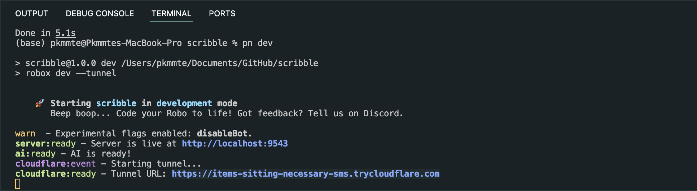

<p align="center">✨ <strong>Generated with <a href="https://roboplay.dev/create-robo">create-robo</a> magic!</strong> ✨</p>

---

# Scribble 🌈

Scribble is a multiplayer drawing game built for Discord Activities where AI comes up with a topic, and players have a few seconds to draw it. The AI then grades the drawings based on how well they match the topic using vision APIs. Highest score wins.

➞ [🎮 **Video:** Watch Scribble in action](https://roboplay.dev/scribble/video)



.

Build, deploy, and maintain your Discord activities with ease. With Robo.js as your guide, you'll experience a seamless, [file-based setup](https://docs.roboplay.dev/docs/basics/overview#the-robojs-file-structure), an [integrated database](https://docs.roboplay.dev/docs/basics/flashcore), [TypeScript support](https://docs.roboplay.dev/docs/advanced/typescript), and a multitude of [plugin-powered skills](https://docs.roboplay.dev/docs/advanced/plugins) to unlock along the way.

➞ [📖 **Tutorial:** Creating a Discord Activity in seconds](https://dev.to/waveplay/how-to-build-a-discord-activity-easily-with-robojs-5bng)

➞ [📚 **Documentation:** Getting started](https://docs.roboplay.dev/docs/getting-started)

➞ [🚀 **Community:** Join our Discord server](https://roboplay.dev/discord)

## Running 🏃‍♂️

Run development mode with:

```bash
npx robo dev
```

Your Robo refreshes with every change. 🔄

A free Cloudflare tunnel is included for easy testing. You can copy and paste it into activity's URL mapping to test things out.

> **Psst...** Check out the [deployment instructions](#deployment) to keep it online 24/7.

## App Development 🛠️

You can find your client-side code in the `/src/app` folder. This is where you can build your web app using React, Vue, or any other front-end framework.

Things are powered by Vite under the hood, so you get the latest ES modules, hot module reloading, and more! ⚡

Try editing the `main` file to get started! (`Activity.tsx` if you're using React)

**➞** [📚 **Documentation:** App development](https://docs.roboplay.dev/docs/app/overview)

#### Authenticating

The React template makes it easy to authenticate your activity with Discord. The `<DiscordProvider>` components in `App.tsx` accepts `authenticate` and `scope` props.

```tsx
<DiscordContextProvider authenticate scope={['identify', 'guilds']}>
	<Activity />
</DiscordContextProvider>
```

You can then get the SDK and other goodies from the `useDiscordSdk` hook!

## Backend Development 🛠️

Your server-side code is located in the `/src/api` folder. This is where you can build your API, webhooks, and other fancy server-side features.

This backend is powered by the [**Server Plugin**](https://github.com/Wave-Play/robo.js/tree/main/packages/plugin-api) - a powerful Robo plugin that creates an manages a Node `http` server for you. If you install Fastify, the server will automatically switch to it for better performance!

Everything Robo is file-based, so you can create new routes by making new files in the `/src/api` directory. The file's name becomes the route's path. For example, let's try making a new route at `/health` by creating a new file named `health.js`:

```js
export default () => {
	return { status: 'ok' }
}
```

Easy, right? Check out the [**Server Plugin documentation**](https://github.com/Wave-Play/robo.js/tree/main/packages/plugin-api) for more info!

## Folder Structure 📁

While the `api` and `app` folders are reserved for your server and client-side code, you are free to create anything else in the `/src` directory!

Folders only become reserved when you install a plugin that uses them. For example, bot functionality uses the `commands` and `events` folders.

## Plugins 🔌

This Robo boasts an intuitive plugin system that grants new capabilities instantly!

```bash
npx robo add @robojs/ai
```

> Swap out [`@robojs/ai`](https://github.com/Wave-Play/robo.js/tree/main/packages/plugin-ai) with your chosen plugin's package name

With that, your Robo automatically equips itself with all the features the plugin offers. Want to revert? Simply use [`robo remove`](https://docs.roboplay.dev/docs/advanced/command-line#plugins) to uninstall any plugin.

**➞** [📚 **Documentation:** Installing plugins](https://docs.roboplay.dev/docs/advanced/plugins#installing-plugins)

Crafting something unique in your Robo project? You can turn your innovations into plugins, be it specific functionalities or your entire Robo. Share your genius with the world!

**➞** [📚 **Documentation:** Creating plugins](https://docs.roboplay.dev/docs/advanced/plugins#creating-plugins)

## Deployment 🚀

Run the `robo deploy` command to automatically deploy to **[RoboPlay](https://roboplay.dev)** for free once you're ready to keep your robo online 24/7.

```bash
npx robo deploy
```

**➞** [🚀 **RoboPlay:** Hosting your Robo](https://docs.roboplay.dev/docs/hosting)

You can also self-host your robo anywhere that supports Node. Just make sure to run `robo build` followed by `npm start` (alias for `robo start` here):

```bash
npx robo build
npm start
```

You can also run `robo invite` (beta) to automatically generate a server invite to test it yourself or show it off! You can also use the **[Discord Developer Portal](https://discord.com/developers/applications)** to generate an invite as usual.

```bash
npx robo invite
```

Happy coding! 🎉
